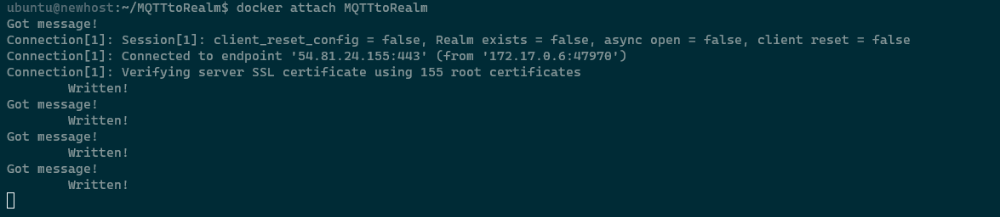
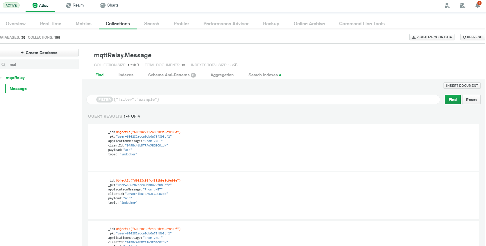

# MQTTtoRealm

This is a simple proof of concept to act as a middleware console app to take in IOT sensor data via MQTT (act as a broker) and write those messages into MongoDB Atlas using Realm Sync.

# Setup
## Pre Reqs
* Deploy an Atlas Cluster
* Deploy a Realm App on that cluster
* Have docker installed
* Have a MQTT load generator such [as mine](https://github.com/graboskyc/MQTTProducer) or [my mobile](https://github.com/graboskyc/MQTTProducer-Android)
  
## Realm Setup
* Turn on Sync Developer Mode
  * Choose the cluster you deployed earlier as the sync target cluster
  * Database is `realmvr`
  * Schema is in the `Realm` folder of this repo
* Turn on API Key authentication
* Generate an API Key

## Code Setup
* Clone this repo onto a server
* make a .env file: `cp sample.env .env`
* Edit the .env and replace the values with that of your Realm App ID and the API Key you generated in the previous step
* Run `./build.sh` which will start the docker container for you using the above variables

## One time initial setup
* If this is the first time running, go back into Realm after the container starts, and disable developer mode
* Disable the anonymous authentication
* In the Atlas cluster you should now see a new DB as setup in the Realm Setup step with a new collection called `Message` and a JSON Schema has been applied to it in Realm.
* Restart your docker container

## Execution
* Point your MQTT clients at this now running MQTT broker.
* As an example, edit the Home Assistant configuration.yaml as shown [here](https://www.home-assistant.io/integrations/mqtt/)

# Screenshots

